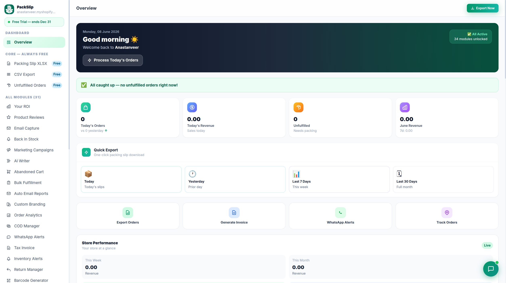
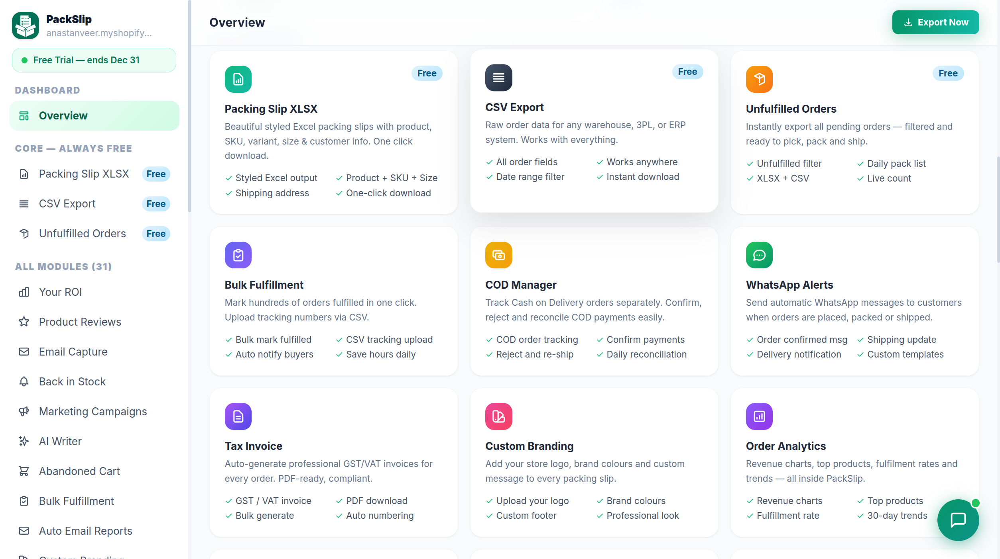

<div align="center">

# 📦 PackSlip — Landing Page

### One app to run your whole Shopify store's fulfillment.

Packing slips · Bulk fulfillment · Branded order tracking · WhatsApp & email alerts · and more.
**34 modules. One app. 100% free.**

<br>

[](https://apps.shopify.com/packslip-dev)
&nbsp;

&nbsp;


</div>

---

## ✨ Overview

A high-conversion, animated **single-page landing site** for the **PackSlip** Shopify app.
Built as one self-contained `index.html` — no build step, no framework, just drop it on any host.

> 🔗 **Live:** [packslip.arsdeveloper.co.uk](https://packslip.arsdeveloper.co.uk)
> 🛍️ **App:** [apps.shopify.com/packslip-dev](https://apps.shopify.com/packslip-dev)

---

## 🖼️ Preview

| Dashboard | Modules |
|-----------|---------|
|  |  |

---

## 🚀 Features

- 🎬 **Animated hero** — word-by-word headline reveal + gradient text
- 🧊 **3D tilt dashboard** — real perspective mockup that follows your mouse
- 💬 **Floating order chips** — live-style notifications around the hero
- 🌌 **Animated mesh background** — drifting glow orbs + 3D grid floor + grain
- 🃏 **3D tilt feature cards** with depth
- 🏷️ **Glass pill marquee** with fade edges (pauses on hover)
- 📊 **Animated counters** + scroll-reveal (GSAP ScrollTrigger)
- 📍 **Sticky blur nav** + scroll progress bar
- 💸 **"One app instead of five"** value section
- ❓ **Accordion FAQ**
- 📱 Fully **responsive**

---

## 🛠️ Tech Stack

| | |
|---|---|
| **Layout** | Tailwind CSS (CDN) |
| **Animation** | GSAP + ScrollTrigger |
| **Fonts** | Clash Display + Satoshi (Fontshare) |
| **Build** | None — pure static `index.html` |

---

## 💻 Run Locally

```bash
# from the project folder
python3 -m http.server 8765
# then open
http://localhost:8765
```
> Internet is required (Tailwind, GSAP and fonts load from CDN).

---

## 🌐 Deploy

It's a static page — just upload `index.html`, `landing-1.png` and `landing-2.png` to any web root.

**nginx example** (`packslip.arsdeveloper.co.uk`):
```nginx
server {
    listen 80;
    server_name packslip.arsdeveloper.co.uk;
    root /var/www/packslip-landing;
    index index.html;
    location / { try_files $uri $uri/ /index.html; }
}
```
Then enable HTTPS:
```bash
certbot --nginx -d packslip.arsdeveloper.co.uk
```

---

## 📂 Structure

```
shopify-landing-page/
├── index.html      # the whole landing page
├── landing-1.png   # dashboard screenshot (hero)
├── landing-2.png   # modules screenshot (showcase)
└── README.md
```

---

<div align="center">

Made with 💚 by **ARS Developer**

[Privacy](https://app.arsdeveloper.co.uk/legal/privacy) · [Terms](https://app.arsdeveloper.co.uk/legal/terms) · [Refund](https://app.arsdeveloper.co.uk/legal/refund)

</div>
